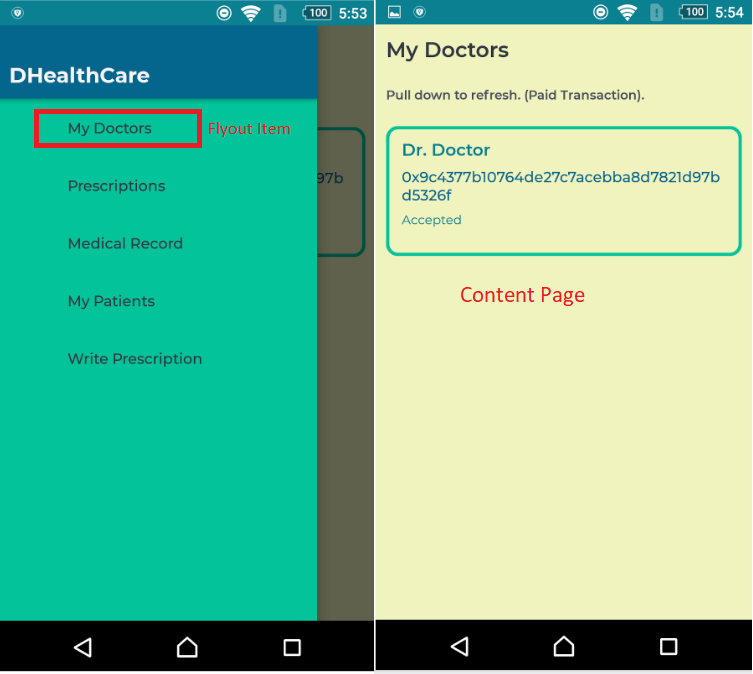

# SEMI-DECENTRALIZED MOBILE APPLICATION

[TOC]


## ABOUT THE PROJECT:

This project is an advanced sample of applications that interact with the **ETHEREUM BLOCKCHAIN** and consume a **WEB API** using **.NET**.

The application's context is the Health-Care domain because it's a field of research at multiple universities.

Throughout this guide, we will discuss multiple coding techniques used in **Xamarin** cross-platform development, **.NET Core**

WEB API development, **Smart Contracts** development, and **Blockchain** general topics.

The project consists of 3 main folders: **MobileAppClient**, **WEB-API**, and **Smart Contracts**.

## Blockchain Discussion:

### What's a blockchain?

Let's suppose we have a bank named A. This bank has multiple branches and no main branch. Therefore all branches are equal, so we have multiple clones of A. In Blockchain terminology, each clone is a **full Node.**

*Note: There are other types of nodes but we will focus on a full Node for the sake of simplicity.*

A bank keeps a record of all his transactions. Some transactions are: send, receive, and deposit.

Digitally, we can execute these transactions and many more. Each set of transactions once executed and mined is assembled into a **block**. A **blockchain** is all these blocks linked together. The blockchain acts as a ledger (record of transactions). 

Since all of the full nodes are equal, they all have this ledger which gives it the attribute: **Distributed**.

The blocks are added to the blockchain**(mined)** following a set of rules and instructions called **consensus algorithms**. There are many algorithms like Proof of authority (POA), Proof of Work (POW), Proof of Stake(POS), and Delegated Byzantine fault tolerance(dBFT). These algorithms are very theoretical and beautiful, but I won't cover them for now because it is out of the scope of this project. 


### What's a smart contract?

*A “smart contract” is simply a piece of code that is running on Ethereum. It’s called a “contract” because code that runs on Ethereum can control valuable things like ETH or other digital assets.* - Ethereum docs.

However, the word contract has no legal meaning under any circumstance. The main features of a smart contract are: deterministic and immutable. Immutable means that once deployed the code cannot be edited. 

Deterministic is getting the same outcome for the same given parameters. There isn't anything random.

Recently smart contracts are developed using the Solidity programming language. 

Smart contracts run on the Ethereum Virtual Machine and the EVM runs as a local instance on every Ethereum node. But, for a smart contract to run on the EVM it is compiled to low-level bytecode.

Once compiled the smart contract is deployed on the Ethereum network. To deploy a smart contract, the contract developer sends a transaction **without specifying** a recipient.

### What's GAS?

Let's say you have a car and you want to go from home to work, you're going to need a definitive amount of oil and you pay for it using USD. This amount will never change unless you change your car.

Remember from the last paragraph, that a smart contract is compiled to bytecode. Under the hood, the EVM uses a set of instructions (called *opcodes*) to execute specific tasks. The bytecode previously mentioned is a set of these opcodes and each opcode execution costs a different amount of gas.

So analogically speaking, the car is the EVM, Gas is the oil and Ether is USD.

To execute a transaction like calling a function of a smart contract you're gonna need gas priced in Ether. 

Note that once created a block has a property called Gas limit and if your transaction requires more than this limit it will not be executed.

Make sure to write your functions with this in mind. We will discuss some tips while programming smart contracts.


## General Programming Topics:

### Asynchronous Programming using async and await keywords:

#### What is Asynchronous Programming?

Assume you order a meal at a fast-food restaurant, a regular chef would perform these actions concurrently which reduces waiting time for the client. 

```c#
public Meal DeliverMeal(){
    Meal m = new Meal();
    m.PrepareFries();
    m.PrepareBurger();
    m.FillSoda();
    return m;
}
```

Unfortunately, this code is executed iteratively by your computer if you don't use asynchronous programming. 

Basically, asynchronous programming is executing multiple tasks outside the main program flow.

For our mobile application, we want the UI to always be responsive to user input. The application shouldn't make a phone appear frozen when fetching data from the web.

When you write server programs, you don't want threads blocked. The more threads blocked, the less the requests processed.

The updated, better performant function is :

```c#
public async Meal DeliverMeal(){
    Meal m = new Meal();
    var fries = m.PrepareFriesAsync();
    var burger = m.PrepareBurgerAsync();
    var soda = m.FillSodaAsync();
    await Task.WhenAll(fries,burger,soda);
    return m;
}

class Meal {
 public async Task<bool> PrepareFriesAsync(){
	 await Task.Delay(3000);
	 Console.WriteLine("Fries Done");
	 return true;
 }
}
```

Consider adding the suffix Async to your new methods. There are many asynchronous calls in our project make sure to check them out.

### The  Model-View-ViewModel Pattern:

The Model-View-ViewModel (MVVM) helps to separate the logic of an application from its user interface (UI). This separation makes the application testing and maintenance a lot easier. Also, it greatly improves code re-use. Besides, it allows developers and UI designers to work simultaneously and collaborate more often.

There are 3 main components of the MVVM pattern:  the View, the View Model, and the Model. The figure below extracted from [Microsoft Docs](https://docs.microsoft.com/en-us/xamarin/xamarin-forms/enterprise-application-patterns/mvvm#the-mvvm-pattern) describes the relationship between them. 


As you can see the view is aware of the View Model and the View Model is aware of the Model. Therefore the View Model isolates the View from the Model. Changing the Model's code is a time-consuming process. For example:  changing a Model's code requires updating the WEB API.

#### The View:

The View is related to the user interface, whether it's a Content Page or just a Content View. Each view is written in [XAML](https://docs.microsoft.com/en-us/xamarin/xamarin-forms/xaml/xaml-basics/) and its code-behind consists of animations logic. 

To react to the user input, the view sends data to the View Model using [data bindings](https://docs.microsoft.com/en-us/xamarin/xamarin-forms/xaml/xaml-basics/data-binding-basics) and/or commands if a control implements the Command Property.

#### The View Model:

The View Model contains the business logic related to the View or references to it, the actions of each Command, and a reference to the Model.
The View Model sends notifications to the View using the PropertyChanged property found in the INotifyPropertyChanged interface.

#### The Model :

Model are classes that are schemas to the app's data with some validation logic here and there. 

The View Model performs CRUD operation on the Model.

**Note:** That's just a brief introduction to MVVM, we will implement it in detail, in the Mobile App Section.


##  Required Tools(Win 10):

### MongoDB:

#### **Why do we need MongoDB? **

A fully decentralized application has its data only stored on the Ethereum blockchain. Using the Ethereum Blockchain as the single data storage location has numerous limitations : Modification requests cost ether(money) and are slow to process (15 secs) which causes a bad user experience .In Addition each smart contract has a maximum capacity of around ~**1.2 GB**.

Our Application is semi-decentralized which means we use a web api and a database to process large data in addition to the Ethereum blockchain.

#### **What is MongoDB?**

*MongoDB is a cross-platform document-oriented database program.  Classified as a NoSQL database program, MongoDB uses JSON-like documents with optional schemas* .  -Source GOOGLE.

Document Oriented means that data isn't stored in **tables** but in JSON documents  that are stored in collections.

A schema is **optional** ,unlike SQL a table cannot be created without the pre-definition of its fields.

***In this project , I am using schemas.***

#### Configure [MongoDB](https://www.mongodb.com/download-center/community):

If using Windows, MongoDB is installed at **C:\Program Files\MongoDB** by default.

1. Choose a directory on your development machine for storing the data. For example, ***C:\HealthCareDatabase***. Create the directory if it doesn't exist. ***The mongo Shell doesn't create new directories.*** 

2. Open a command shell (**CMD)** and change the directory to your MongoDB installation folder.
   Run the following command to connect to MongoDB on default port **27017**. Remember to replace <data_directory_path> with the directory you chose in the previous step.

   ```
   mongod --dbpath <data_directory_path>
   ```

3. Open another command shell instance and insert the following commands.

   ```
   mongo 
   use HealthCareDb
   ```

   If it doesn't already exist, a database named **HealthCareDb** is created. If the database does exist, its connection is opened for transactions.

4. Create all collections iteratively:

   ```
   db.createCollection('Patients')
   db.createCollection('Prescriptions')
   db.createCollection('Modifications')
   db.createCollection('Drugs')
   ```
   

The following result is displayed after each creation:

```
   { "ok" : 1 }
```

**WARNING:   DO NOT INSERT ANY DOCUMENT INTO THE COLLECTION USING SHELL COMMANDS, WE WILL DO THIS WITH OUR WEB API LATER , AFTER DEFINING OUR SCHEMAS.**


### Ethereum Wallet Creation:

#### What is an Ethereum Wallet ?

Wallets are applications that make it easy to hold and send ETH, as well as interact with applications built on Ethereum.

The most important properties of an Ethereum  Wallet are the **address** and the **private key** , and we won't use more than these keys for interacting with our smart contracts.

#### Keys Generation Process:

***Note:** You can skip this paragraph if you don't want to learn about this process, it wouldn't affect the project in any way.*

The first step is to create a random private key using SHA256. 

[SHA256](https://en.wikipedia.org/wiki/SHA-2) stands for secure hash algorithm.

Private keys are generated as random 256 bits, which is 64 (hex) characters or 32 bytes. You must make sure that the random key generated is unique enough, do not generate it using numbers only because it will be prone to collision attacks. Luckily, Nethereum (the .Net Ethereum client) has a strong private keys generator. There are also other options like Metamask to create your private keys if you're not enough comfortable doing this yourself.  In this project, we will be using both Nethereum and Metamask for demonstration purposes. Also, Metmask is essential to deploy our smart contracts later.

After the private key generation, Ethereum public keys of length 128 characters are created using an algorithm called Elliptic Curve Digital Signature Algorithm (ECDSA). Ethereum uses [secp256k1](https://en.bitcoin.it/wiki/Secp256k1) to generate public keys. A public key is a point in this Elliptic curve algorithm.

To create an Ethereum Address, [the keccak256](https://en.wikipedia.org/wiki/SHA-3) algorithm is applied to the coordinates of the public key.

#### Creating The Ethereum Wallet:

1. Install [Google Chrome](https://www.google.com/chrome/index.html).
2. Install [Metamask chrome extension ](https://chrome.google.com/webstore/detail/metamask/nkbihfbeogaeaoehlefnkodbefgpgknn)and create your Ethereum wallet.
3. Get some Ethereum **Testnet** faucets : https://faucet.rinkeby.io/ , I’ll be using Rinkeby Testnet.
   After developing our smart contracts, we will deploy them to the blockchain for further testing and we will use a **Testnet** because it's free.
4. Wait for around 15 secs and you'll see those faucets transferred to your account using **MetaMask**. Make sure to have selected Rinkeby Test Network option.

#### Creating an [Infura](https://infura.io/) account:

Infura is a hosted Ethereum node cluster that lets you interact with the Ethereum Blockchain without the need to setup your own Ethereum Node.

Instead of creating our own node locally, we use Infura to access Rinkeby Testnet.

Go to Infura website and create your account **(there's the possibility of free account)**, then create a new project.

### Configuring Your IDEs:

For Smart Contracts development we will be using  [Remix](https://remix.ethereum.org/), an online Ethereum IDE.

For the WEB API and Mobile Application Development we will be using [VISUAL STUDIO 2019 COMMUNITY EDITION](https://visualstudio.microsoft.com/downloads/), make sure to Install  .Net Core and Xamarin development tools during setup or feel free to add them later.


## Architecture - Global Scope:


Here's the basic architecture, the remote database is only accessible through the WEB API. -*technically through the webserver hosting the WEB API-*

The mobile application consumes the WEB API , interacts with the Ethereum blockchain through the Infura Cluster **which is part of the Ethereum Network** and saves some data locally .


## Smart Contracts Programming

### General:

**Note: We will only discuss what we've used in Solidity. For a detailed documentation *[click here](https://solidity.readthedocs.io/en/v0.6.10/)*.**

#### Used Types:

- **address**: Holds a 20-byte value (size of an Ethereum address). there's also **address payable** with the additional members *transfer* and *send*. We will transfer ether to other addresses but not using smart contracts, so there's no need for the payable address.
- **mapping**: You can think of mappings as hash tables, with a very important main difference that every possible key "exists" and is mapped to a type's default value. Technically not all the possible keys exist but are generated on call.
- **Struct**: A struct is a composite data type declaration that defines a grouped list of variables.

#### Functions:

Functions take typed parameters as input and may, unlike in many other languages, also return an **arbitrary number** of values as output.

Function parameters are declared the same way as variables.

Function return variables are declared with the same syntax after the **returns** keyword and their name can be omitted.

#### View Functions:

Functions can be declared as **view** in which case they promise not to modify the state.

The following statements are considered modifying the state:

1. Writing to state variables.
2. Emitting events
3. Creating other contracts
4. Using **selfdestruct**.
5. Sending Ether via calls.
6. Calling any function not marked **view** or **pure**.
7. Using low-level calls.
8. Using inline assembly that contains certain opcodes. 

Here's  a sample of function declaration.

```c++
function DoubleandTriple (int number) public view returns(int,int){
        return (number*2,number*3);
    }
```

#### storage and memory Keywords:

**storage:** Each account has a data area called **storage** which is persistent between function calls and transactions.

To reference a struct on storage, we use the **storage** keyword.

**memory**: The memory keyword is used when we would like to return a struct from a function. But I've replaced the procedure of returning a struct with extracting its fields and returning them using the multiple return values solidity feature.

#### Important Tips:

**A function that modifies the storage shouldn't return anything.**

**Make sure that only View functions return data.**

**Loops cost a huge amount of gas avoid using them at all costs.**

### Doctors Smart Contract:

The doctors smart contract is the file named *Doctors.sol*. 

It contains a mapping of a doctor's address to a Boolean indicating whether the holder of this address is a doctor or not.

Also, we have a field that holds the contract's creator address.

The creator is set in the constructor using the **global object msg**.

The function entitled **add** modifies the storage to add a doctor. **This action is only executed by the creator of the contract**.

The function entitled **check** returns if the address passed as a parameter references a doctor.

The function entitled **change_creator**, changes the address of the creator to a new address added provided as a parameter. **This action is only executed by the original creator of the contract**.


### Drugs Smart Contract:

The drugs smart contract is the file named Drugs.sol.

It contains a mapping of an unsigned integer representing the drug's id to an unsigned integer (64 bit) representing the drug's price in **Gwei**(1000000000 Gwei = 1 Eth). I've used the unit Gwei for more precise pricing of drugs.

Also, we have a field that holds the contract's creator address.

The function entitled **add** modifies the storage to add a drug, using two parameters: the drug's code and its price. **This action is only executed by the creator of the contract**.

The function entitled **get** returns the price of a drug, using its code as a parameter.

The function entitled **change_creator**, changes the address of the creator to a new address added provided as a parameter. **This action is only executed by the creator of the contract**.


### Patient Doc Manager Smart Contract:

The Relationship Manager smart contract is the file named PatientDocManager.sol.

#### Address Container Struct:

This struct is for doctors only, it stores the address(max. 3) of the pending add requests from patients.

#### Status Struct:

This struct is for patients only, it stores the pending add request status(pending, accepted and rejected) and the doctor's address.


The **ForDoc** mapping maps a doctor's address to his address container struct.

The **ForPatient** mapping maps a patient's address to his status struct.

The **azero** address represents an all-zeros address.


The **checkDoctorQueue** function, checks if a doctor's address container is full by comparing each address to the **azero**. Notice that we used the **storage keyword** to access the doctor's address container. **This function returns true if the container isn't full**.

```c++
function checkDoctorQueue(address doc) public view returns(bool){
        AddressContainer storage doc_queue = ForDoc[doc];
        if(doc_queue.one == azero || doc_queue.two == azero || doc_queue.three == azero) return true;
        return false;
    }
```


The **checkDuplicateRequest** function, checks if the patient has already sent an add request to the doctor, by comparing each address in the doctor's address container to the **msg.sender**. This function returns true if the add request is already sent.

The **checkPossibility** function, checks if the patient has no other pending requests, and **returns true if a patient can send an add request**.

The **add** function, adds the sender's address(patient) to the doctor's address container. It finds the first **azero** and replaces it with the patient's address, then update's the patient's address. **This function is invoked by a patient only**.

The **getDoc** function, accepts and unsigned integer (index) as a parameter and returns the correspondent address from the doctor's address container. 

The **respond** function accepts a patient's address and an unsigned integer (1: accepted, 2: rejected) to update his status struct. Then, it removes the patient's address from the doctor's address container. **This function is invoked by a doctor only**

The **getPatient** function extracts the data of the patient's status struct and returns them separately.

The **updatePatient** function clears the data of the patient's status struct. **This function is invoked by a patient only.**

**WE WILL DISCUSS THE IMPLEMENTATION OF THESE FUNCTIONS EFFICIENTLY IN THE MOBILE APP SECTION**.


### Smart Contracts Deployment:

1. Open Chrome and make sure to have the Rinkeby Test Network selected.

   

   

2. Go to [Remix](https://remix.ethereum.org/) , the online Ethereum IDE.

3. Upload a Smart contract.

4. Click on the Solidity compiler tab, to compile the Smart contract.

5. Go to the Deploy and run transactions tab.

6. Select the **Injected Web3** as Environment. For Debugging Locally use **JAVASCRIPT VM**.


7.  The following prompt will appear.

   

   

   

8. Click the Orange Deploy button and **save the deployed contract's address**.

   

   **Repeat steps 3 to 8 for every smart contract attached to the project.**


## WEB API Programming

**NOTE1: This WEB API is very simple, for demonstration and learning purposes.**

**NOTE2: To get a better understanding of how to create and configure a WEB API check this brief [documentation](https://docs.microsoft.com/en-us/aspnet/core/tutorials/first-mongo-app?view=aspnetcore-3.1&tabs=visual-studio#create-the-aspnet-core-web-api-project).**

### PROJECT DEPENDENCIES

1. **Microsoft.VisualStudio.Web.CodeGeneration.Design** *version* 3.1.3
2. **MongoDB.Driver** *version* 2.10.3

### ABOUT MODELS

Remember when I said that we are using schemas for our MongoDB, well the classes found in the Models folder are these schemas. They define the template of each document in our collections and also the template of each object passed to the WEB API by the mobile application. I'm not going to dive into each class's properties as we will talk about them concretely in the Mobile Application Programming section.

### ABOUT SERVICES

Services contain classes that perform create, read, update, delete, and sometimes other types of operations to our MongoDB. Generally, each service is related to a controller. Some controllers might require more services while others wouldn't require one because of their simplicity. But it is a good practice to do keep your services separated from your controllers for code reuse and easier debugging. Also, You can simplify the creation of your services by some OOP tricks and design patterns, but for the sake of simplicity, we will not do that here.

### ABOUT CONTROLLERS

Controllers, as simple as it can get, are the classes responsible for processing the user requests and sending the appropriate response. 

Each controller has the following attributes: 

```c#
 [Route("api/[controller]")]
    [ApiController]
    [ApiKeyAuth]
    public class DrugsController : ControllerBase
```

A route so that application knows where to access the desired controller.

The ApiController attribute so that the server  knows that the following class is a controller and should be treated differently.

The ApiKeyAuth attribute is to check that each request has an attached API Key . We will discuss this later as we introduce the concept of filters.

Functions of the controller are bound to an HTTP action like get and post for example. So once the controller's route is called with a specific HTTP action, the function bound to the desired action is executed.

A controller function acts as the following:

1. Validate the user's data. If data is invalid return a response status code (4xx mostly) to the user with some information.
2. Call functions from the controller's **SERVICE**.
3. Return a response to the user. 

```c#
  		// GET: api/Patient/
        [HttpGet("{id}")]
        public async Task<IActionResult> Get(string id)
        {
            if (id.Length != Requirements.PatientIdLength)
                return BadRequest();

            var patient = await _patientService.Get(id);

            if (patient == default(Patient))
            {
                var p = new Patient()
                {
                    Id = id,
                    Allergies = new List<string>(),
                    BloodType = string.Empty,
                    EmergencyContacts = new List<string>(),
                    MedicalNotes = new List<string>()
                };
                await _patientService.Create(p);
                return (Ok(p));
            }

            return Ok(patient);
        }

```

### ABOUT API KEY AUTH ATTRIBUTE


**File Path:** /ApiKeyAuthAttribute.cs

To Access our WEB API we will need a key.  So for each request we will need to compare a sent key from the application with our key, doing this for each controller function is very repetitive and error prone. Thus, we introduce the concept of Filters which is, in our case, code executed before the main call of a controller's function. 

```c#
 [AttributeUsage(validOn: AttributeTargets.Class)]
    public class ApiKeyAuthAttribute : Attribute, IAsyncActionFilter
```

The ApiKeyAuthAttribute class derives from the Attribute class so we can use it as an attribute and implements the Async Action Filter interface :

```c#
public async Task OnActionExecutionAsync(ActionExecutingContext context, ActionExecutionDelegate next)
        {
        }
```

The context is all of the request's parameters like headers, and next is the destination's controller.
Here's the logic of the OnActionExecutionAsync:

```c#
private readonly string ApiKeyHeaderName = "x-api-key";
var exists = context.HttpContext.Request.Headers.TryGetValue(ApiKeyHeaderName, out var received_key);
            var api_key = context.HttpContext.RequestServices.GetRequiredService<IConfiguration>().GetValue<string>("ApiKey");

            if (!exists || api_key!=received_key)
            {
                context.Result = new UnauthorizedResult();
                return;
            }
            await next();
```

The explanation to the code above is the following :

1. Check our request headers for a header named "x-api-key" and try to get its value.
2. Find the true API Key in **/appsettings.json** and store its value in api_key. **MAKE SURE TO STORE THE REAL VALUE OF THE API KEY BEFORE STARTING THE SERVER**.
3. we check that the user has submitted an API key then we compare the received key and the real key.
4. If they aren't equal we return an Unauthorized status code , else we continue to our controller using the next() function.

The Final code of the filter or middleware is :

```c#
using Microsoft.AspNetCore.Mvc;
using Microsoft.AspNetCore.Mvc.Filters;
using Microsoft.Extensions.Configuration;
using Microsoft.Extensions.DependencyInjection;
using System;
using System.Threading.Tasks;

namespace HealthCareWebAPI
{
    [AttributeUsage(validOn: AttributeTargets.Class)]
    public class ApiKeyAuthAttribute : Attribute, IAsyncActionFilter
    {
        private readonly string ApiKeyHeaderName = "x-api-key";
        public async Task OnActionExecutionAsync(ActionExecutingContext context, ActionExecutionDelegate next)
        {
            var exists = context.HttpContext.Request.Headers.TryGetValue(ApiKeyHeaderName, out var received_key);
            var api_key = context.HttpContext.RequestServices.GetRequiredService<IConfiguration>().GetValue<string>("ApiKey");

            if (!exists || api_key!=received_key)
            {
                context.Result = new UnauthorizedResult();
                return;
            }
            await next();
        }
    }
}
```

Now we just add the [ApiKeyAuth] attribute code to every controller.

### STARTING THE WEB API

1. Open a command shell **(CMD)** and change the directory to your MongoDB installation folder.
   Run the following command to connect to MongoDB on default port **27017**. Remember to replace <data_directory_path> with the directory you chose for mongo data storage. For EXAMPLE:

   ```shell
   cd C:\Program Files\MongoDB\Server\4.2\bin
   mongod --dbpath C:\Users\WAEL\Documents\HealthCareDatabase
   ```

2. Open a command shell **(CMD)** and run the command ipconfig to get your local IP address.

3. In the WEB API Solution navigate to Properties/**launchSettings.json** and add your local IP to the application URL key **in the last line** of the JSON file because we will be debugging **using KESTREL** not IIS:

   ```json
   {
     "iisSettings": {
       "windowsAuthentication": false,
       "anonymousAuthentication": true,
       "iisExpress": {
         "applicationUrl": "http://localhost:56433",
         "sslPort": 44353
       }
     },
     "$schema": "http://json.schemastore.org/launchsettings.json",
     "profiles": {
       "IIS Express": {
         "commandName": "IISExpress",
         "launchUrl": "weatherforecast",
         "environmentVariables": {
           "ASPNETCORE_ENVIRONMENT": "Development"
         }
       },
       "HealthCareWebAPI": {
         "commandName": "Project",
         "launchBrowser": true,
         "launchUrl": "weatherforecast",
         "environmentVariables": {
           "ASPNETCORE_ENVIRONMENT": "Development"
         },
         "applicationUrl": "http://192.168.1.69;http://localhost:5000"
       }
     }
   }
   ```

4. Select to debug using **KESTREL** and click run.

   

##  Mobile Application Programming

### USE CASE DIAGRAM

**Use Case Diagram:** A use case diagram at its simplest is a representation of a user's interaction with the system that shows the relationship between the user and the different use cases in which the user is involved. -Source Wikipedia.

The following Use Case Diagram represents the mobile application's main features and the two types of users(actors).


### PROJECT DEPENDENCIES

1. **Nethereum.Web3** *version* 3.7.1 
2. **Refit** *version* 5.1.67 
3. **sqlite-net-pcl** *version* 1.6.292 
4. **Syncfusion.Xamarin.Buttons** *version* 18.1.0.53 
5. **Syncfusion.Xamarin.Core** *version* 18.1.0.53 
6. **Syncfusion.Xamarin.DataSource** *version* 18.1.0.53
7. **Syncfusion.Xamarin.Expander** *version* 18.1.0.53 
8. **Syncfusion.Xamarin.SfComboBox** *version* 18.1.0.53 
9. **Syncfusion.Xamarin.SfListView** *version* 18.1.0.53 
10. **Xamarin.Forms** *version* 4.6.0.726 
11. **Xamarin.Essentials** *version* 1.5.3.1 

### PROJECT STRUCTURE

* **Contracts:** contains schemas of : the local database , remote MongoDB, and other models used throughout the app .

* **Controls:** a set of custom controls and renderers provided by [Syncfusion Essential UIKit.](https://github.com/syncfusion/essential-ui-kit-for-xamarin.forms/tree/master/EssentialUIKit)
* **Ethereum:** contains code related to smart-contracts interaction and configuration file that links the app to a public node offered by Infura.
* **LocalDatabase:** code related to SQLite table mappings, initialization and queries .
* **Themes**: markup files related to design , fonts, and general control styles.
* **ViewModels** : all the app's view models.
  Note: the folder Navigation is provided by [Syncfusion Essential UIKit](https://github.com/syncfusion/essential-ui-kit-for-xamarin.forms/tree/master/EssentialUIKit) and used as is.
* **Views:** all the app's views.
* **WebInterface**: code to interact with the WebAPI.
* **AccountManager**: Ethereum wallet built on top of Nethereum.
* **App.xaml**: application's startup code.
* **DiverseExtensionMethods.cs**: useful functions used across the app.

### ABOUT CONTRACTS

**Some classes are Models as they interact with the Database, others are Contracts as they just read from it**.

1. #### Local Storage Models:

   - **Credentials.cs:**	 
     Represents a patient's Ethereum wallet Public and Private Keys.
   - **Doctor.cs**: 
     Represents a patient's doctor consists of 3 Fields: Doctor's Address, Doctor's Name , and Status (Pending or Accepted Request).
   - **PatientContact.cs:**
     A Patient's contact card stored in the doctor's contact list . Consists of a patient's address and name.

2. #### **Online Storage Models:**

   - **Modification.cs:**
     A patient's file modification submitted by a Doctor. Consists of : Timestamp , Doctor's Address, Patient's Address , Type( Allergies or MedicalNotes) and Data(Comment).
   - **Prescription.cs**:
     A prescription submitted by a doctor to a patient. Consists of : Timestamp , Doctor's Address, Patient's Address ,  MedicineCode and a Comment.
   - **Patient.cs**:
     A patient's medical record .Consists of : Address, Blood Type(Modified by patient), Emergency Contacts(Modified by patient), Medical Note(Modified by doctor) and Allergies(Modified by doctor).


   

   ### ABOUT LOCAL DATABASE

   **NOTE: DATABASE AND TABLE CREATION OPERATIONS ARE SYNCHRONOUS , CRUD OPERATIONS ON TABLES ARE ASYNCHRONOUS**

   1. #### Constants.cs:  

      - Database File Name.

      - Flags : read, write, create and multi threaded database access.

      - Database Path.

        

   2. #### SynchronousInit.cs:    

      - This is class creates the database and all of its tables synchronously on startup, because they are mandatory to run the application.

      - conn : the Database Connection object.

      - Connect(): creates the connection object **conn**.

      - Exists(): returns true if a table exists.

      - Create(): creates a table.

      - Constructor(): Calls the functions Connect(),Exists(),and Create() for all the mandatory tables then closes the **synchronous **connection.

        

   3. #### TaskExtensions.cs:

      - SafeFireAndForget(): Extension Method for the Task object to detect runtime exceptions.

        

   4. #### HealthCareDatabase.cs:

      - This class contains the main logic for CRUD operations on the LocalDatabase.

      - lazyinitializer :  "*Lazy initialization* of an object means that its creation is deferred until it is first used." --**MicrosoftDocs**

        a **unique** initializer for an **Asynchronous**  connection to the App's local database.

      - Database : returns the value of the lazy initializer , in this case the DB connection.

   5. #### **DatabaseInstance.cs**: 

      Singleton design pattern applied for HealthCareDatabase.cs class initialization and access.

### ABOUT WEB INTERFACE

Contains two CSharp files :

1. **IHealthCareAPI.cs**: An interface that defines all the HTTP requests to the WEB API. Note that the interface also defines as a header for the API key. In the case of production apps, an API Key is not enough. An identity server is required. But In our case, where there's only one endpoint (the application) and to not complicate the project, the API Key enough. The API Key should remain **secret**. Here's a chunk of the code. 

   ```c#
   [Headers("x-api-key: 052e876dc900aaba74880f5a97a902a551933ebc3421e5d4d6d54c35db552455")]
       interface IHealthCareAPI
       {
           [Get("/api/Prescriptions/Patient/{id}")]
           Task<List<Prescription>> GetPrescriptions(string id);
           [Get("/api/Patient/{id}")]
           Task<Patient> GetPatientFile(string id);
           [Get("/api/Modifications/{id}")]
        }
   ```

   

2. **WebClient.cs:** Singleton design pattern for a unique instance of  IHealthCareAPI class.
   **Note:** Make sure to set the BaseURL **same as your** WebAPI URL, otherwise you'll get an invalid host error.

### ABOUT ETHEREUM

#### Config.cs:

- **URL** : This is your the URL to your **project's** Infura endpoint. Make sure to have selected **RINKEBY** as an endpoint and copy the **https** link .
  

- **Web3**: This a collection of libraries that allow you to interact with an Ethereum Node. In our case it's the Infura Cluster, using an HTTPs connection. **Nethereum** creates your Web3 client using your active account (public and private key) and the route to the Ethereum Node. Therefore our Config class initializer requires our account from the Account Manager Class and the URL to the Infura Endpoint. 

- **Important Note:** Infura doesn't sign your transactions for you because in that case, this means that your private key will be passed using the https connection which is less secure, so you'll have to sign your transactions offline which is cumbersome. Luckily Nethereum does that for you.

  

  #### Smart Contracts:

  In the Ethereum folder you'll notice a folder for each smart contract used in our application.

  

  

  The Definition class, in its most trivial way, represents the contract's ABI but in C# syntax. ABI stands for *application binary interface*. In an Ethereum context, it's basically how to encode Solidity contract calls for the EVM and how to read the data out of transactions.

  ##### **Important Note:** 

  A function in the Service Class which name contains the QueryAsync suffix **just reads data from the smart contract's storage**.

  ```c#
  public Task<ulong> GetQueryAsync(GetFunction getFunction, BlockParameter blockParameter = null)
          {
              return ContractHandler.QueryAsync<GetFunction, ulong>(getFunction, blockParameter);
          }
  ```

  A function in the Service Class which name contains the RequestAsync or RequestAndWaitForReceipt suffix **modifies the smart contract's storage** and هit takes longer to notice the changes **because of the mining process.**

  ```c#
         public Task<TransactionReceipt> AddRequestAndWaitForReceiptAsync(AddFunction addFunction, CancellationTokenSource cancellationToken = null)
          {
              return ContractHandler.SendRequestAndWaitForReceiptAsync(addFunction, cancellationToken);
          }
  ```

  ##### Implementation:

  The Service and Definition classes can be autogenerated by Nethereum using VsCode **[Read More Here](https://nethereum.readthedocs.io/en/latest/nethereum-codegen-vscode-demo/#prerequisites)**. 

  I modified the code a bit so we can use our **Config** class previously mentioned.

  Here's a sample on how to call a smart contract's function :

  ```c#
  Config.Init(AccountManager.Instance().GetActiveAccount());
  
  var doctors_service = new Ethereum.DoctorsSmartContract.Service(Config.Instance().Web3Instance);
  
  var is_doctor = await doctors_service.CheckQueryAsync(Address, null);
              
  ```

  Don't worry about multiple initializations of the Config class , because it will be initialized only once (**Singleton Pattern**).

  Notice how the init function takes our active account as a parameter, then we create the smart contract's service using the unique Web3 Instance to finally call our query.

  

### APPLICATION STARTUP CODE

#### What's [Shell](https://docs.microsoft.com/en-us/xamarin/xamarin-forms/app-fundamentals/shell/)?

Briefly, in Xamarin shell a freshly introduced UI cross platform layout . It's main aspect is that each flyout item opens a content page, similarly to master detail but the code is a lot more organized, maintainable and easier to write. It also has many more important features to be discussed later.




#### App.xaml:

Adds the fonts and colors found in the themes to the Application's resource dictionary.

####  **App.xaml.cs** :

1. Synchronous initialization of the database and its required tables.
2. Instantiation of a new App Shell.
3. Registration of routes not found in Shell's flyout menu.
4. Read from the database previous credentials. 
5. Initialize the Account Manager class.
6. If there are no credentials found in the database, navigate to the login page. If there are -which means that the user is already logged in-, then set the Account Manager active account using the found credentials. 

```c#
  public App()
        {
            InitializeComponent();
            new SynchronousInit();
            MainPage = new AppShell();
        }

        protected async override void OnStart()
        {
            Routing.RegisterRoute("login", typeof(LoginPage));
            Routing.RegisterRoute("details", typeof(DetailPatientView));
            var cred = await DatabaseInstance.Database.GetCredentials();
            var manager = AccountManager.Instance();
            if (cred != null) manager.SetActiveAccount(cred.PrivateKey);            
            else
                await Shell.Current.GoToAsync("login", true);

        }
```

### LOGIN MVVM

#### The View:

- **File Path**: /Views/LoginPage.xaml and /Views/LoginPage.xaml.cs

- **Screenshot:**

  

  

  

  

- **Resource Dictionary:**  /Themes/ControlStyles.xaml
  The ControlStyles.xaml file contains numerous styles for controls : labels, entries, etc... In more complex applications, it is recommended to separate the control styles for each view.

- **Static Resource vs Dynamic Resource:** Xamarin holds an **accessible** reference in memory for each dynamic resource created so it can be updated during runtime based on user interaction, for example: switching the app theme from light to dark. In our application, we've only used static resources. **However, a not found static resource will throw a runtime exception.**

  ```xaml
  <Label
                          FontFamily="{StaticResource Montserrat-SemiBold}"
                          FontSize="20"
                          HorizontalTextAlignment="Center"
                          Style="{StaticResource LabelStyle}"
                          Text="Log In"
                          TextColor="{StaticResource Gray-900}" />
  
  ```

  

- **Data Binding:** To access properties of the View Model we use data binding using the Binding keyword.

  ```xaml
  <border:SfBorder
                          Grid.Row="3"
                          BackgroundColor="{StaticResource PaleSpringBud}"
                          BorderColor="{Binding PrivateKeyColor}"
                          Style="{StaticResource SfBorderStyle}">
                              <control:BorderlessEntry
                              IsPassword="True"
                              Placeholder="Address"
                              PlaceholderColor="{StaticResource Gray-700}"
                              Style="{StaticResource EntryStyle}"
                              Text="{Binding PrivateKey}"
                              TextColor="{StaticResource Gray-900}" />
  ```

- **Binding Context:** Our application uses multiple view models , so how do we link each view to its proper view model ?
  The answer is using the Binding Context associated to every content page. We can do this using C# or Xaml. I've done it in c# . The code is found in /Views/LoginPage.xaml.cs . **Here's a sample:**

  ```c#
  public partial class LoginPage : ContentPage
      {
          LoginViewModel vm = new LoginViewModel();
          public LoginPage()
          {
              InitializeComponent();
              this.BindingContext = vm;
          }
       }
  ```

  

  #### The View Model:

  - **File Path:** /ViewModels/LoginViewModel.cs

  - **Address property:** This is the string entered by the user as an address, with every character change there's a certain amount of validation to update the view accordingly by raising the  PropertyChanged Event that takes as a parameter the ViewModel( the one who changed the property) and the property's name.

  - **Private Key property:**  This is the string entered by the user as a private key, with every character change there's a certain amount of validation to update the view accordingly by raising the  PropertyChanged Event that takes as a parameter the ViewModel( the one who changed the property) and the property's name.

    **Sample of the Property Changed Event Invocation:**

    ```c#
    public string Address
            {
                get { return address; }
                set
                {
                    address = value;
                    AddressError = (address.Length != AddressLength) || !address.All(c => 		         char.IsLetterOrDigit(c));
                    AddressColor = AddressError ? Color.Red : Color.Green;
                    AddressErrorText = AddressError && (address.Length != AddressLength) ? Errors[0] : Errors[2];
    
                    PropertyChanged?.Invoke(this, new PropertyChangedEventArgs(nameof(AddressError)));
                    PropertyChanged?.Invoke(this, new PropertyChangedEventArgs(nameof(AddressColor)));
                    PropertyChanged?.Invoke(this, new PropertyChangedEventArgs(nameof(AddressErrorText)));
    
                }
            }
    
    ```

    **Side Note:** It is recommended to use converters when you have too much validation logic and related properties.

    - **The Verify Command:**
      This is a command that checks the private key and public key correspondence using the verify function. However, the View cannot directly access functions found in a view model. Therefore each function is wrapped in a **Command** object preferably in the view model's constructor like the following:

      ```c#
      public LoginViewModel()
      {
          Command VerifyCommand = new Command(async () => await Verify());
      }
      ```

    - **The Create Command:**

      This is a command that generates private keys for new users using Nethereum by calling the Generate Account function found in the Account Manager class.

      ```c#
      public static Account GenerateAccount()
              {
                  var ecKey = Nethereum.Signer.EthECKey.GenerateKey();
                  var privateKey = ecKey.GetPrivateKeyAsBytes().ToHex();
                  var account = new Account(privateKey);
                  return account;
              }
      ```

      

### MY DOCTORS MVVM

#### The View:

- **File Path**: /Views/DoctorsView.xaml and /Views/DoctorsView.xaml.cs
- **Description:** The Add button found in the **NavBar**, triggers the Add Doctor dialog on/off .
  The Collection view shows the list of all the patient's doctors(**Stored Locally**) including: their Names, their addresses, and a status whether it's a pending or accepted request.
- **Screenshots:** 


#### The View Model:

- **File Path:** /ViewModels/DoctorsViewModel.cs

- **Add Doctor Command:** 

  1. Checks if there's any other request from the user's device to the Ethereum network.

  2. Validation for the user input.

  3. Checks if the doctor's address is already in the user's local database.

  4. Queries the **Doctors Smart Contract** to check if the address provided is a doctor's address.

  5. Queries the **Patient Doc Manager Smart Contract** to check if the user has a pending request.

  6. Queries the **Patient Doc Manager Smart Contract** to check if the doctor's queue is full.

  7. Queries the **Patient Doc Manager Smart Contract** to check if the user's has already a pending add request for the doctor with the provided address.

  8. Adds the user's address to the doctor's queue by means of the **Patient Doc Manager Smart Contract**.

  9. Saves the Doctor's information locally with a status of **Pending**.

     **Here's a simplified flow chart:**

     *Note: Purple color indicates that the related chunk of code is executed on the Ethereum Network.*

     

     

     

- **The Refresh Command:** This command is responsible for refreshing the doctors list, it is not called unless the user triggers it because it is payable.

  1. Search the local doctors table for the doctor with a pending status.
  2. Query the **Patient Doc Manager Smart Contract** for the patient's Status struct.
  3. Read the value of the status : 0 is for a pending request, 1 is for an accepted request, 2 for a reject request.
  4. In case of an accepted request, we update the **local database**, then we clear our Status struct found in the **Patient Doc Manager Smart Contract**.
  5. In case of a rejected request, we remove the doctor from our **local database**, then we clear our Status struct found in the **Patient Doc Manager Smart Contract**.

  

#### Observable Collection

By examining thoroughly the View Model, you might have encountered the Type ObservableCollection<T>. To put this collection in good use we bind it as a data source for a certain view because any **update** concerning **one of its items** will be automatically detected by the view which means we don't have to invoke the **PropertyChanged** event. 

#### Discussion

The process of adding a doctor is very secure, because it totally relies on the Ethereum Network. 

The verified doctors addresses are stored in a smart contract, and only the creator of this contract can alter the data.

Also, only the patients/doctors who hold their respective private keys can alter their proper data, no third party can interfere not even the relationship manager smart contract creator. 

In addition, privacy is extremely guaranteed because the Ethereum Network isn't concerned about usernames and emails, your address is the only thing that matters and it not being to a name online gives you the amount of privacy you need. 


### PRESCRIPTIONS MVVM

#### The View:

- **File Path**: /Views/PrescriptionsView.xaml and /Views/PrescriptionsView.xaml.cs

- **Description**: This view shows all the drugs prescribed by his doctors with the ability to purchase them using Ether.

- **Screenshot:**

  

  

#### The View Model:

- **File Path:** /ViewModels/PrescriptionsViewModel.cs

- **The internal Projection class**: The response to a Get("/api/Prescriptions/Patient/{id}") request is a List of objects of type Prescription found in /Contracts/Prescription.cs: 

  ```c#
  class Prescription
      {
          public int Timestamp { get; set; }
          public string DoctorId { get; set; }
          public string PatientId { get; set; }
          public string MedicineCode { get; set; }
          public string MedicineName { get; set; }
          public string Comment { get; set; }
      }
  ```

  As you can see, some properties are very hard to understand for the user like the Timestamp which is an integer that denotes the time of the prescription written as well as the DoctorId . Therefore we can bind a List of prescriptions to the view . The idea behind the Projection class is to execute a bit of computation to enhance the user experience , in this particular case we are looking to change the timestamp by a real date and the DoctorId by his name before binding a collection of Projections to the view.

- **The Get Prescriptions Command:**

  1. The user sends a GetGet("/api/Prescriptions/Patient/{id}") where id is his address.

  2. The server responds with a List of prescriptions.

  3. The application then **filters** the prescriptions using an **Inner Join query** to select only prescriptions from the doctors that are in the  local patient's doctors table.

     ```c#
     var query = prescriptions.Join(docs,
                      prescription => prescription.DoctorId,
                      doc => doc.Address,
                      (doc, prescription) => (Projection)doc);
     ```

  4. Finally we project the remaining prescriptions to a Projection class.

- **The Buy Command:**

  1. Using the **Drugs Smart Contract Service**, we get the drug's price.

  2. We Convert the drug's price to **Ether**.

  3. We transfer **simultaneously** Ether to an Address that represents the drugs store and the Prescribing doctor's address to as bill.

     ```c#
                Task t1 = Config.Instance().Web3Instance.Eth.GetEtherTransferService()
                .TransferEtherAndWaitForReceiptAsync("0xa3ED2A76c48B5BF3D5B92C1CcB97D989996D886B",price);
                Task t2 = Config.Instance().Web3Instance.Eth.GetEtherTransferService()
                     .TransferEtherAndWaitForReceiptAsync(p.DoctorId, price);
                t1.Start();
                t2.Start();
                Task.WaitAll(t1, t2);
                await Application.Current.MainPage.DisplayAlert("Sucess", "Successfully Paid", "OK");
     
     
     ```

     #### Discussion:

     The Security in the Get prescriptions command resides in the join operation, because the hacker needs to bypass the WEB API security, then he has to guess a doctor's address and **his** patient's address which is very hard to achieve noticing that nothing is stored online.

     The Security in the Buy command resides in the drugs smart contract which stores the drug prices according to their code because only the creator of the contract can alter the prices.

### MEDICAL RECORD MVVM

#### The View:

- **File Path**: /Views/PatientView.xaml and /Views/PatientView.xaml.cs

- **Description:** This View shows the patient's medical record including his: address, blood type, emergency contacts, medical notes and allergies.

- **Screenshots:** 

  

- This View clearly emphasize the resources importance whether they are static or dynamic, because as you can see there's quite a resemblance between the frames , so instead of constantly remodifying the visual properties like colors and thickness, we do this only once by creating a style.

  ```xaml
  <border:SfBorder Style="{StaticResource  PatientViewBorderStyle}">
                      <StackLayout>
                          <Label Text="Allergies:" 
                         Style="{StaticResource  PatientViewLabelStyle}">
                          </Label>
                          <BoxView Style="{StaticResource  PatientViewBoxViewStyle}"></BoxView>
                          <CollectionView 
                                  ItemsSource="{Binding Allergies}"
                                  Style="{StaticResource PatientViewCollectionViewStyle}">
                              <CollectionView.ItemTemplate>
                                  <DataTemplate>
                                      <Label Text="{Binding}"
                                             Style="{StaticResource PatientViewLabelDataTemplateStyle}"></Label>
                                  </DataTemplate>
                              </CollectionView.ItemTemplate>
                          </CollectionView>
                      </StackLayout>
                  </border:SfBorder>
  ```

  

#### The View Model:

- **File Path:** /ViewModels/PatientViewModel.cs

- **The Add Command**: The patient adds an emergency contact by clicking the circular button, however the changes are not saved unless the **Submit Changes** button is clicked.

- **The Delete Emergency Contact Command:** The patient has the ability to delete an emergency contact,however the changes are not saved unless the **Submit Changes** button is clicked. This command is special because it requires a parameter , which is the Emergency contacts collection view, so in xaml we have to do the following adjustments:

  ```xaml
  <CollectionView x:Name="emergencyContactsCollectionView"
                                          Style="{StaticResource PatientViewCollectionViewStyle}"
                                          ItemsSource="{Binding EmergencyContacts}"
                                          SelectionChangedCommand="{Binding DeleteEmergencyContactCommand}"
                                          SelectionChangedCommandParameter="{x:Reference emergencyContactsCollectionView }">
  ```

  Notice how we referenced the collection view using its name as the command parameter. Also, we have to create our command in C# by doing the following:

```c#
            var DeleteEmergencyContactCommand = new Command<CollectionView>(async(x) => await DeleteEmergencyContact(x));

```

As you can see the command parameter type is between the <> diamond operator ,  and then between parentheses we have a lambda expression where x denotes the collection view object which in this case the emeregencyContactsCollectionView.

#### Discussion: 

In a worst case scenario where the database documents aren't encrypted, it is very hard to guess whom the patient's file belongs two. Unless, this patient has a lot of emergency contacts that can help narrow down the possibilities.

### MODIFICATIONS MVVM

#### The View:

- **File Path**: /Views/ModificationsPage.xaml and /Views/ModificationsPage.xaml.cs

- **Description:** This View shows pending modifications to a patient's medical record, the patient has the right to allow or deny each modification separately.

- **Screenshot:** 
  

  

#### The View Model:

- **File Path:** /ViewModels/ModificationsViewModel.cs

- **The internal Projection class**: The response to a Get("/api/Modifications/{id}") request where id is the patient's address is a List of objects of type Prescription found in /Contracts/Modification.cs: 

  ```c#
  class Modification
      {
          public int TimeStamp { get; set; }
          public string PatientAddress { get; set; }
          public string DoctorAddress { get; set; }
          public string Type { get; set; }
          public string Data { get; set; }
      }
  ```

  The aim of the projection is to alter the doctor's address with the correspondent name found in the patient's local database.

  The fields shown to user are : The name of the doctor who suggested the modification, the type of the modification(allergies or  medical note) and the modification.

- **The Get Prescriptions Command:**

  1. The user sends a Get("/api/Modifications/{id}") where id is his address.

  2. The server responds with a List of Modifications.

  3. The application then **filters** the modifications using an **Inner Join query** to select only modifications from the doctors that are in the  local patient's doctors table.

     ```c#
     var query = modifications.Join(doctors,
                     modification => modification.DoctorAddress,
                     doc => doc.Address.ToLower(),
                     (modification, doc) => modification).ToList();
     ```

  4. Finally we project the remaining modifications to a Projection class.

- **The Accept/Reject Modification Command:**

  1. The patient selects an action whether it's accept or reject.
  2. If the patient has selected the accept modification action, the application sends a Post("/api/Modifications/Respond") request.
  3. Finally the application sends a Delete("/api/Modifications/{id}") request. **This request is sent , no matter which action the user has chosen.**

#### Discussion:

The Security in the Get modifications command resides in the join operation because the hacker needs to bypass the WEB API security, then he has to guess a doctor's address and his patient's address which is very hard to achieve knowing that nothing is stored online.

Besides, this application requires the patient's consent before modifying any field of his medical record.

### MY PATIENTS MVVM

#### The View:

- **File Path**: /Views/PatientsView.xaml and /Views/PatientsView.xaml.cs

- **Description:** This View shows the doctor's patients in a grouped list and provides the ability to search by name .Once an Item is tapped, a doctor can access his medical record and suggest modifications.

- **Screenshot:** 

  

  

  

#### The View Model:

- **The Get Patients Command:** We load the patients asynchronously from the local database as Patient Contact objects. The Patient Contact object is found in Contracts/PatientContact.cs , it consists of two properties: the patient's name and his address.

- **The Tap Command:** This command takes as a parameter the Searchable Contact List in order to get its selected item. The special thing about this command is that it uses Shell's built -in query logic as an elegant way to pass data to a shell content page .In our particular case, it's the **patient's details** page. Here's the associated segment of code: 

  ```c#
          async Task Tap(SearchableContactsList cv)
          {
              if (cv.SelectedItem == null) return;
              var item = (cv.SelectedItem as PatientContact);
              await Shell.Current.GoToAsync($"details?address={item.Address.ToLower()}");
              cv.SelectedItem = null;
          }
  
  ```

  

### 


### PATIENT'S DETAILS PAGE MVVM

#### The View:

- **File Path**: /Views/DetailPatientView.xaml and /Views/DetailPatientView.xaml.cs

- **Description:** This View shows the patient's medical record including his: address, blood type, emergency contacts, medical notes and allergies like the Medical Record View and adds the possibility to suggest a modification.

- **Screenshot:** 

  

- **Code Behind:** Remember how we previously said that this code takes data from the previous after the invocation of the Tap command. In order to achieve this we must use a simple attribute and set the binding context differently by implementing the following code:

  ```c#
      [QueryProperty("Address", "address")]
      public partial class DetailPatientView : ContentPage
      {
          DetailsPatientViewModel vm;
          public string Address
          {
              set
              {
                  BindingContext = vm = new DetailsPatientViewModel(value);
              }
          }
       }
  ```

  

#### The View Model:

- **The Get Patient Command:** This commands gets the patient's medical record using a Get("/api/Patient/{id}") request.
- **The Submit Modification Command:** Submits Post("/api/Modifications") request which body contains a modification object found in Contracts/Modification.cs


### PENDING REQUESTS MVVM


#### The View:

- **File Path:** /Views/PendingRequests.xaml and /Views/PendingRequests.xaml.cs

- **Description:** This view allows the doctor to check for pending patient requests, accept or reject them. In case of accepting a request he must insert a name in order to save the data locally. I used a Button to fetch the data, only to show you that data of a collection view can be updated in many different way.

- **Screenshot:**

  

  #### The View Model:

  - **File Path:** /ViewModels/PendingRequestsViewModel.cs

  - **The internal Request class:** When a doctor's reads his requests from the Ethereum blockchain, he only gets addresses . Our Request class adds the following properties to the address:

    ```c#
    internal class Request
            {
                public string Address { get; set; }
                public string Name { get; set; }
                public Command RejectCommand { get; set; }
                public Command AddCommand { get; set; }
    
            }
    ```

    

  - **The Get Command:** 

    1. Create a new relationship manager smart contract service.

    2. We know that a doctor's requests queue (Address container) is of size 3 and for loops in solidity require a great amount of gas. Therefore we have to have to query the smart contract 3 times using an index to get the content of the doctor's address container , therefore we use a  for loop to execute the **get_doc(index)** function of our smart contract like the following.

       ```c#
       var relationship_manager = new Service(Config.Instance().Web3Instance);
       
                   for (int i = 0; i < 3; i++)
                   {
                       var address = await relationship_manager.GetDocQueryAsync(i);
                       if (address.IsZero()) continue;
                       Requests.Add(new Request()
                       {
                           AddCommand = addCommand,
                           RejectCommand = rejectCommand,
                           Address = address.ToLower()
                       });
                   }
       ```

    3. After getting each address of the address container, we have to check if it's an address that consists entirely of zeros. If so we neglect it.

    4. Non zero address are added to the Requests observable collection and bound to their commands.

  - **The Accept Command:**

    1. Checks if the doctor has set a name for his new patient.
    2. Create a new relationship manager smart contract service.
    3. Send a respond request with the following parameters : patient's address, and an integer of value 1. The value 1 means that the patient's request has been accepted.
    4. Save the patient to our local database as a Patient Contact object.

  - **The Reject Command:**

    1. Create a new relationship manager smart contract service.
    2. Send a respond request with the following parameters : patient's address, and an integer of value 2. The value 2 means that the patient's request has been rejected.


### WRITE PRESCRIPTIONS MVVM


#### The  View:

- **File Path:** /Views/Drugs.xaml and /Views/Drugs.xaml.cs

- **Description:** This view allows a patient and a doctor to search for a certain drug by its name, if found its information is displayed. However a doctor can only prescribe it. This view also contains a searchable combo-box to easily select the concerned patient.

- **Screenshot:** 

  


#### The View Model:

- **File Path:** /ViewModels/WritePrescriptionViewModel.cs

- **The Get Patients Action**: This function loads the patient contact objects from the local database into the combo-box.

- **The Search Command**: 

  1. This function sends a Get("/api/Drugs/") request with the entered drug's name as a  Query parameter.

  2. If a drug is found, the response body would hold a JSON object serializable into a Drug object found in /Contracts/Drug.cs with the following definition: 

     ```c#
     class Drug
         {
             public string _id { get; set; }
             public string BrandName { get; set; }
             public string Strength { get; set; }
             public string Presentation { get; set; }
             public string Form { get; set; }
     
         }
     ```

     If you have any difficulties understanding any of these properties please refer to the previous screenshot.

  3. Create a drugs smart contract service.

  4. Query the drugs the smart contract  **get_drug(code)** where code represents the drug's id , to get his price.

  5. The price is received in Gwei so we have to convert it to Ethereum.

- **The Prescribe Command:**

  1. Check that the combo box has a selected value.
  2. Check that there's a comment like how or when to take the drug.
  3. Check that the one who is prescribing the drug is a doctor by querying the Doctors smart contract.
  4. Create a prescription object found in /Contracts/Prescription.cs and add it as body to the Post("/api/Prescriptions/") request.

### STARTING THE MOBILE APPLICATION

1. Start your WEB API, if you didn't start it yet.
2. Deploy the smart contracts and save their address, if you didn't deploy them yet.
3. Go to Ethereum Folder and for every smart contract service assign the **Contract Address** property.
4. Go to Web Interface folder and set the BASE URL equal to your WEB API URL.
5. Run the project.

